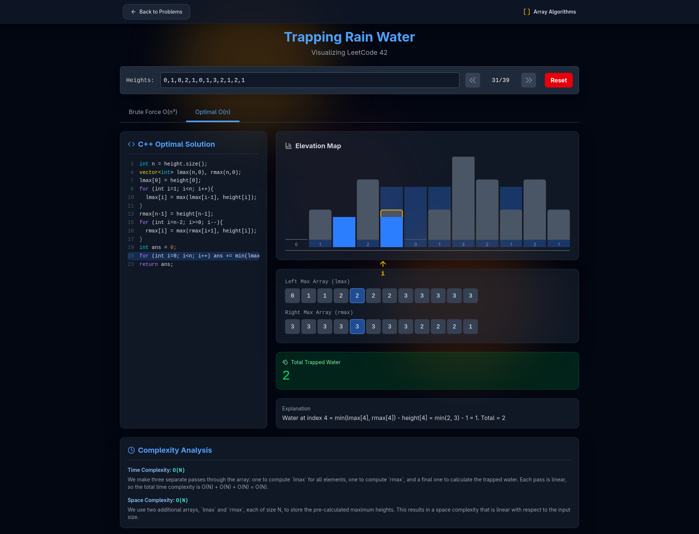

# 🎨 AlgoVisualizer

<p align="center">
  
</p>


## 🌟 Overview

**AlgoVisualizer** is a modern web application that helps students and developers **understand Data Structures and Algorithms** through real-time visualizations.  
Built with **React**, **Vite**, and **Tailwind CSS**, it offers a smooth, interactive, and visually appealing way to learn complex concepts.

---

## ✨ Features

- 🎯 **Real-Time Visualizations** — See algorithms in action step-by-step
- 🚀 **Interactive Controls** — Play, pause, and control execution speed
- 💻 **Code & Complexity Views** — Learn the logic behind the scenes
- 🧠 **AI Learning Assistant** — Powered by Google Gemini API
- 🎨 **Modern UI** — Responsive, minimal, and distraction-free
- 📚 **Comprehensive Coverage** — Sorting, graph, recursion, and more

---

## 🛠️ Tech Stack

| Technology   | Purpose                 |
| ------------ | ----------------------- |
| React        | Frontend framework      |
| Vite         | Build tool & dev server |
| Tailwind CSS | Styling                 |
| JavaScript   | Algorithm logic         |
| Vercel       | Deployment              |

---

## 📁 Project Structure

```bash
AlgoVisualizer/
├── public/
├── src/
│   ├── components/
│   ├── pages/
│   ├── search/
│   ├── App.jsx
│   ├── main.jsx
│   └── index.css
├── package.json
├── vite.config.js
└── README.md
```

---

## 🤖 AI Learning Assistant

AlgoVisualizer integrates **Google Gemini API** to answer algorithm-related questions directly in the app.

Example Questions:

- “Explain Merge Sort step-by-step.”
- “Difference between BFS and DFS.”
- “What’s the time complexity of Quick Sort?”

---

## 📸 Screenshots

<p align="center">
  
</p>

---

## 📚 Learning Resources

- [Big-O Cheat Sheet](https://www.bigocheatsheet.com/)
- [VisuAlgo](https://visualgo.net/)
- [GeeksforGeeks - Algorithms](https://www.geeksforgeeks.org/fundamentals-of-algorithms/)
- [Introduction to Algorithms (CLRS)](https://mitpress.mit.edu/books/introduction-algorithms-third-edition)

---


<p align="center">
⭐ If you find this project helpful, please give it a star on GitHub! ⭐
</p>
